# CloudGuard EC2 Monitoring & Auto Remediation – Implementation

## Overview

This project demonstrates the implementation of an automated monitoring and remediation solution for Amazon EC2 instances using AWS native services.

The solution continuously monitors custom CPU metrics collected by the Amazon CloudWatch Agent. When CPU utilization exceeds the configured threshold, Amazon CloudWatch automatically invokes an AWS Lambda function to reboot the affected EC2 instance without manual intervention.

The implementation showcases a practical cloud operations workflow commonly used to improve infrastructure availability and reduce operational response time.

---

## Architecture Components

- Amazon EC2
- IAM Roles
- Amazon CloudWatch Agent
- Amazon CloudWatch Custom Metrics
- Amazon CloudWatch Alarm
- AWS Lambda
- Amazon EC2 Auto Remediation

---

## 1. Configure IAM Role for Monitoring

An IAM role with the required CloudWatch permissions was created and attached to the EC2 instance, allowing the CloudWatch Agent to publish custom metrics securely.

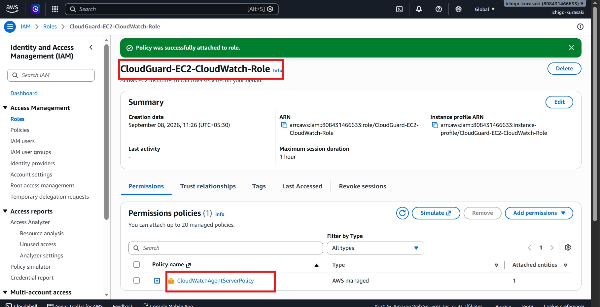

---

## 2. Provision Monitoring Instance

The CloudGuard Development EC2 instance was launched to host the monitoring environment.

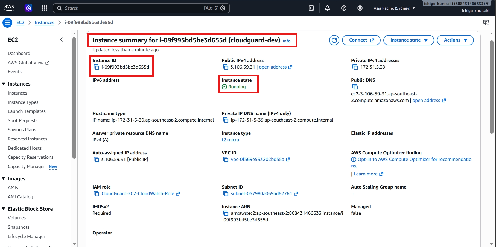

---

## 3. Connect to the EC2 Instance

SSH access was established to configure and manage the CloudWatch Agent.

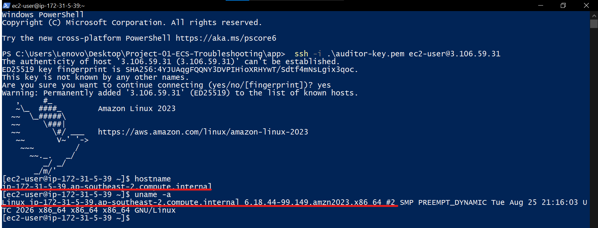

---

## 4. Configure CloudWatch Agent

The Amazon CloudWatch Agent was installed, configured, and verified to be running successfully.

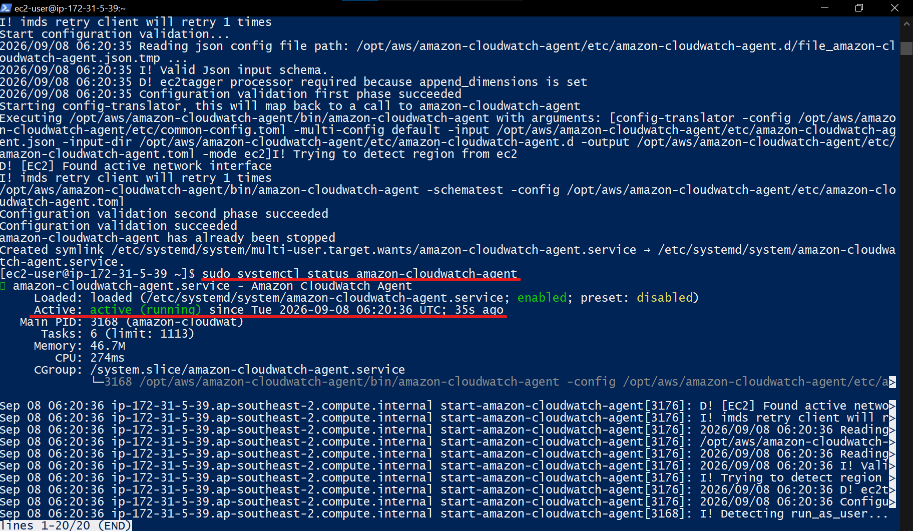

---

## 5. Publish Custom Metrics

The agent began publishing CPU utilization metrics into the custom **CloudGuard** namespace in Amazon CloudWatch.

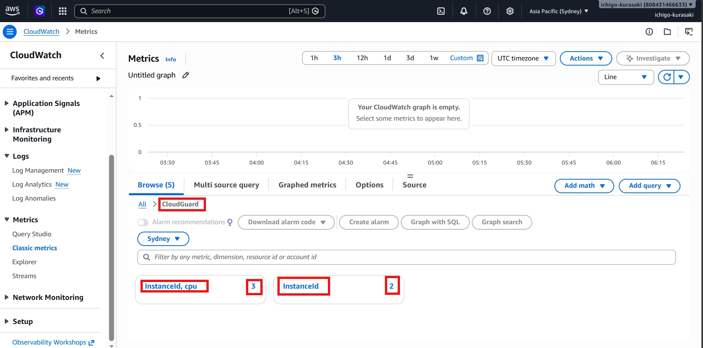

---

## 6. Prepare Production Instance

A second EC2 instance was provisioned to represent the production workload.

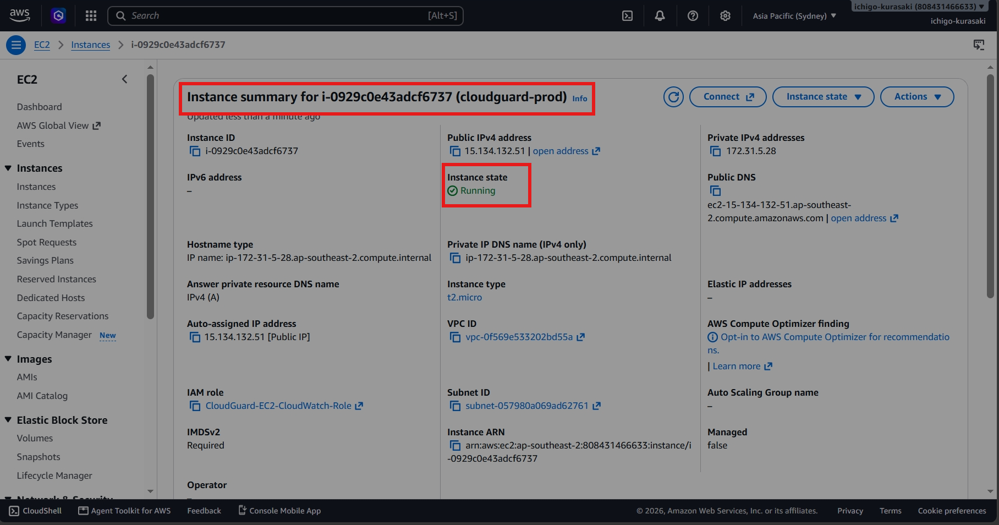

SSH connectivity was verified before configuring monitoring.

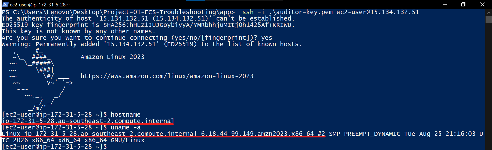

The CloudWatch Agent was configured and confirmed to be operational on the production instance.

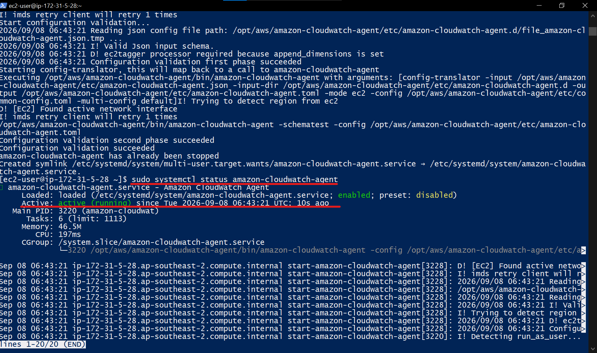

---

## 7. Configure High CPU Alarm

A CloudWatch Alarm was created to monitor the custom CPU metric and detect high CPU utilization.

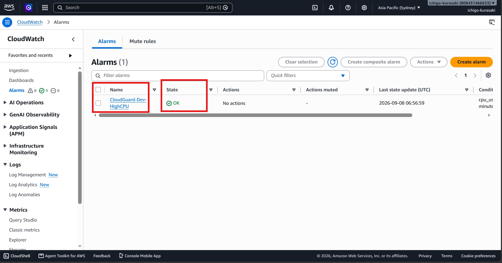

---

## 8. Configure Lambda Permissions

An IAM execution role was created for AWS Lambda, granting permission to reboot EC2 instances.

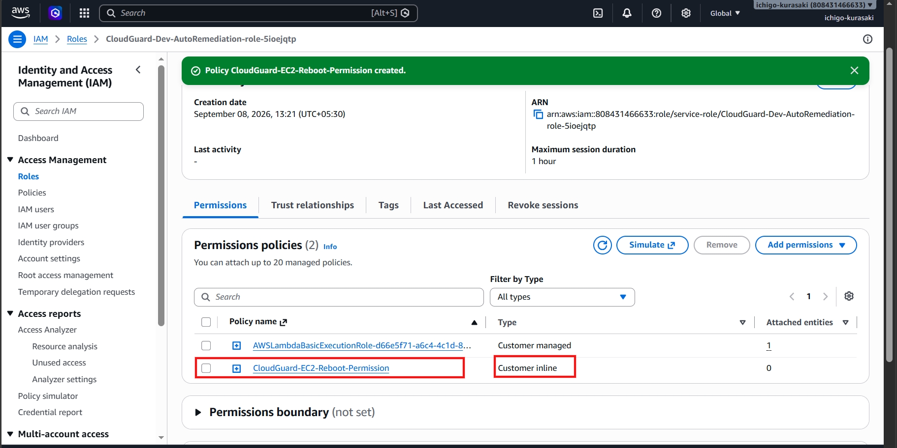

---

## 9. Develop Auto Remediation Function

A Python-based AWS Lambda function was implemented using the AWS SDK (Boto3) to automatically reboot the affected EC2 instance when invoked.

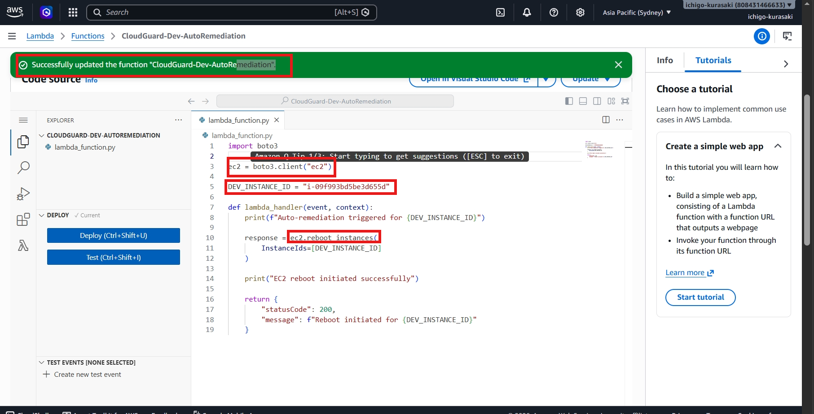

---

## 10. Validate Lambda Function

The Lambda function was tested independently to verify successful EC2 reboot execution.

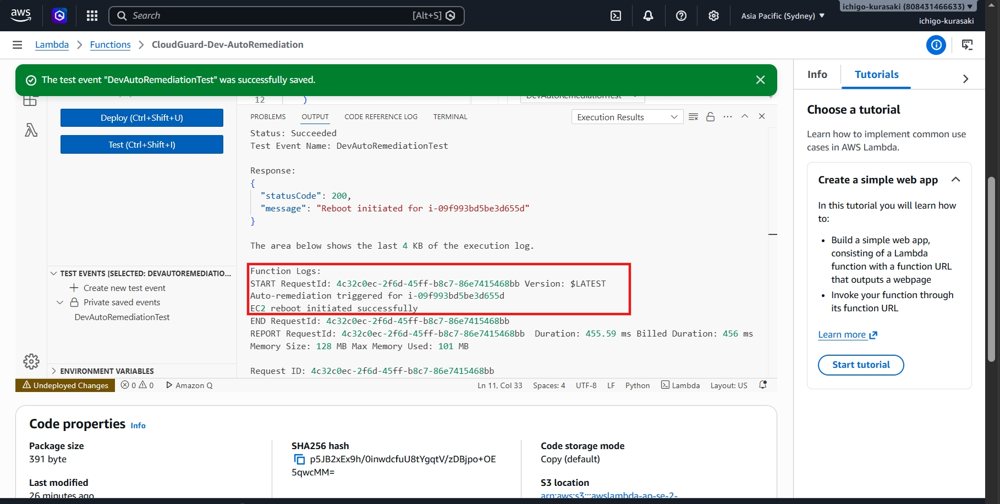

---

## 11. Integrate CloudWatch with Lambda

The CloudWatch Alarm was updated to invoke the Lambda function whenever the configured CPU threshold was exceeded.

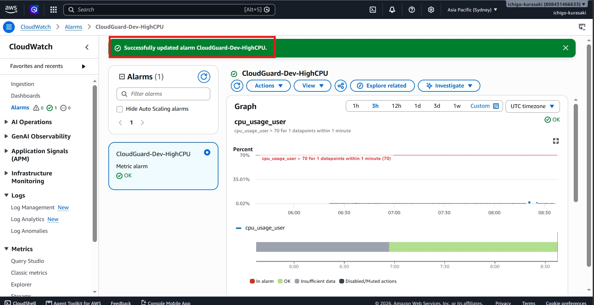

---

## 12. End-to-End Validation

A high CPU condition triggered the CloudWatch Alarm, demonstrating that the monitoring pipeline detected the event successfully.

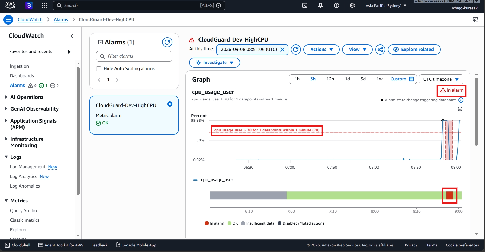

The Lambda execution logs confirmed that the function was invoked and the EC2 reboot action completed successfully.

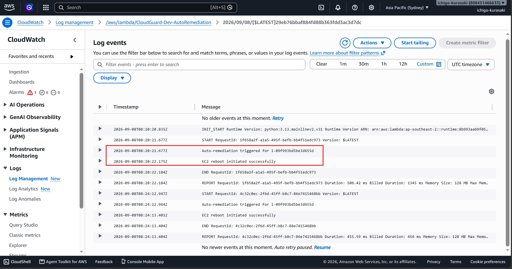

## AWS Services Used

- Amazon EC2
- Amazon CloudWatch
- Amazon CloudWatch Agent
- AWS Lambda
- AWS Identity and Access Management (IAM)
- Amazon SNS (Alarm Notifications)
- AWS SDK for Python (Boto3)

---

## Skills Demonstrated

- AWS Infrastructure Deployment
- Amazon EC2 Administration
- IAM Roles & Permissions
- CloudWatch Agent Configuration
- Custom Metric Collection
- CloudWatch Alarm Configuration
- AWS Lambda Development
- Python Automation
- Infrastructure Monitoring
- Automated Incident Remediation
- Cloud Operations
- Root Cause Validation

---

## Key Takeaway

This project demonstrates the implementation of an event-driven monitoring and automated remediation solution using AWS native services. By integrating CloudWatch monitoring with AWS Lambda automation, the solution reduces manual operational effort, improves infrastructure resilience, and enables faster recovery from high CPU utilization events. The implementation reflects practical cloud engineering and cloud support practices commonly adopted in production environments.
