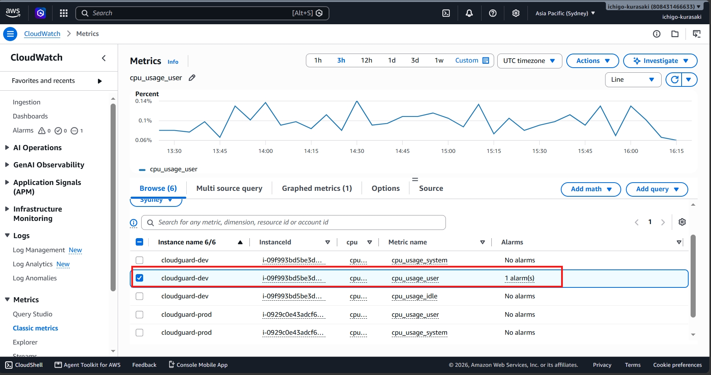
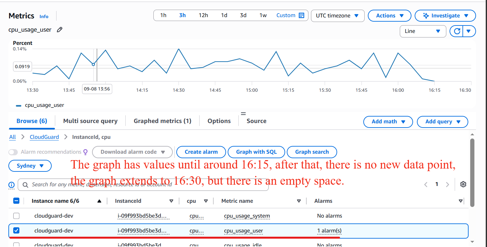
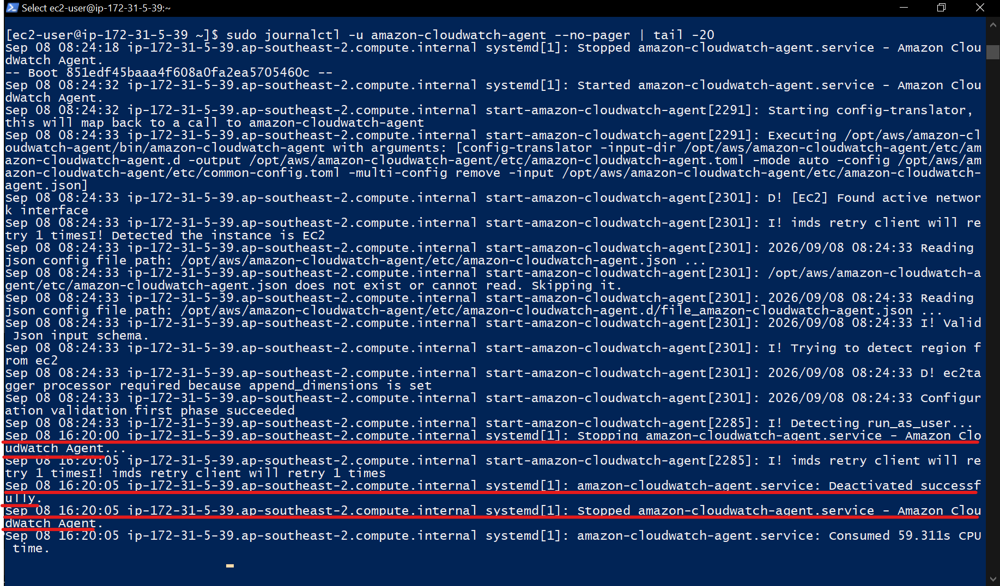
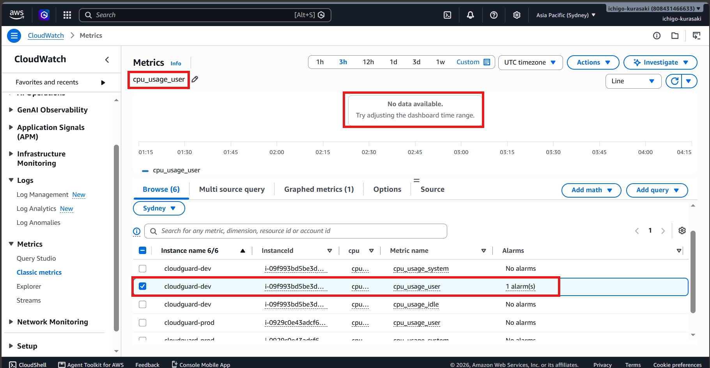
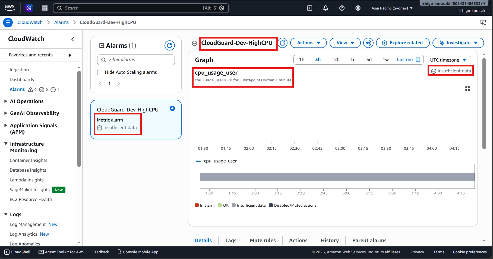
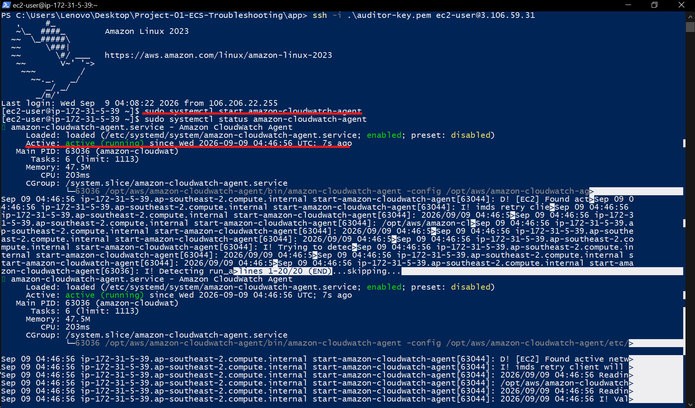
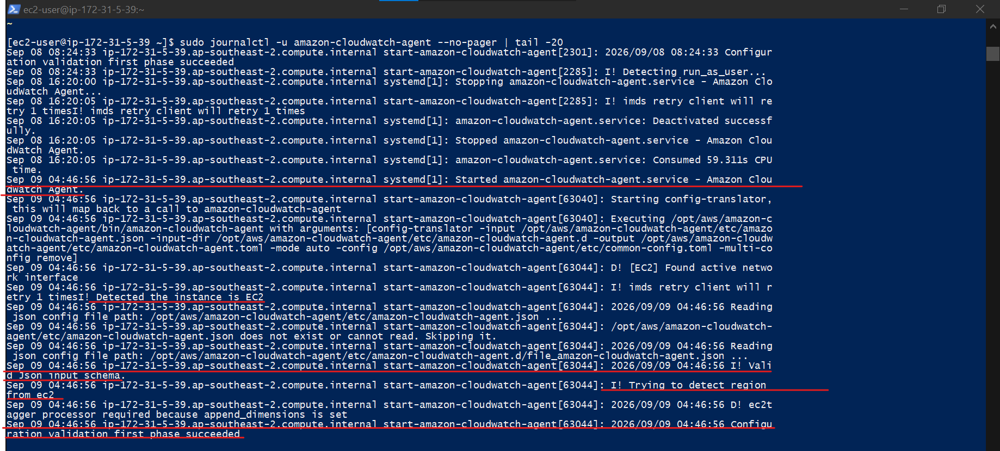
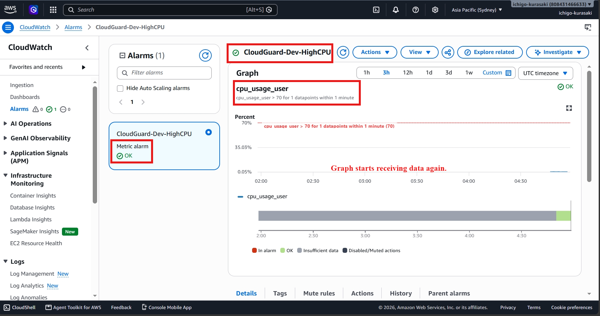

# Incident 01 – CloudWatch Agent Failure

## Overview

During routine monitoring, a controlled failure was introduced by stopping the Amazon CloudWatch Agent running on an EC2 instance.

Although the application itself remained operational, the monitoring agent stopped publishing performance metrics to Amazon CloudWatch. This simulated a common production issue where infrastructure continues running but observability is lost, preventing operations teams from monitoring system health or triggering automated remediation.

---

## 1. Baseline – Custom Metrics Available

Before introducing the incident, the CloudWatch Agent was actively publishing custom CPU metrics to the **CloudGuard** namespace.

This confirmed that monitoring was functioning correctly before the failure was introduced.

---

## 2. Baseline – Metrics Flowing Normally

The CloudWatch metric graph showed continuous CPU metric collection from the EC2 instance.

This established a healthy monitoring baseline.

---

## 3. Incident Introduced – CloudWatch Agent Stopped

The CloudWatch Agent service was intentionally stopped on the EC2 instance to simulate a monitoring failure.

System logs confirmed that the service had been stopped successfully.

---

## 4. Investigation – Metrics No Longer Received

After stopping the agent, CloudWatch stopped receiving new performance metrics.

The existing graph remained visible, but no additional datapoints were published.

### Observed Symptom

> EC2 instance remained healthy, but CloudWatch monitoring data stopped updating.

---

## 5. Monitoring Impact

As metric collection stopped, the associated CloudWatch alarm transitioned to the **Insufficient Data** state because no new datapoints were available for evaluation.

This demonstrated how monitoring failures can directly impact alerting systems.

---

## 6. Resolution – Restart CloudWatch Agent

The CloudWatch Agent service was restarted on the EC2 instance to restore monitoring.

---

## 7. Verification

System logs confirmed that the CloudWatch Agent started successfully and resumed normal operation.

### Root Cause

The Amazon CloudWatch Agent service had stopped running, preventing custom metrics from being published to CloudWatch.

### Resolution

The CloudWatch Agent service was restarted, restoring communication between the EC2 instance and Amazon CloudWatch.

---

## 8. Final Validation – Monitoring Restored

After restarting the service, CloudWatch resumed receiving CPU metrics and the monitoring dashboard returned to normal operation.

This confirmed successful restoration of the monitoring pipeline.

---

## Troubleshooting Method

**Establish Baseline -> Introduce Failure -> Observe Symptoms -> Investigate -> Identify Root Cause -> Restore Service -> Validate Recovery**

---

## Cloud Support Skills Demonstrated

- Amazon EC2 administration
- Amazon CloudWatch monitoring
- CloudWatch Agent troubleshooting
- Linux systemd service management
- CloudWatch Alarm analysis
- Log investigation using journalctl
- Root cause analysis
- Incident recovery and validation

---

## Key Takeaway

This incident demonstrates a practical cloud operations scenario where monitoring infrastructure failed while the EC2 instance continued running normally.

Rather than focusing only on application availability, the investigation identified a loss of observability, restored the CloudWatch Agent service, and verified that monitoring and alerting resumed successfully. This reflects the type of operational troubleshooting commonly performed by Cloud Support and Cloud Operations Engineers.
