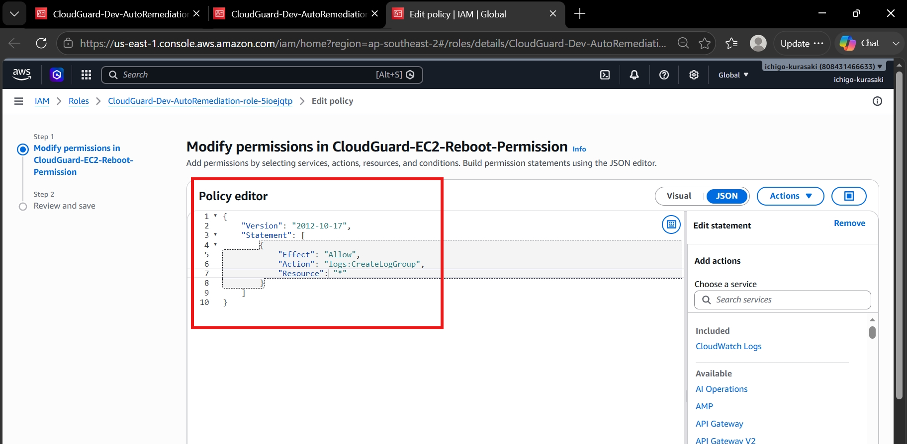
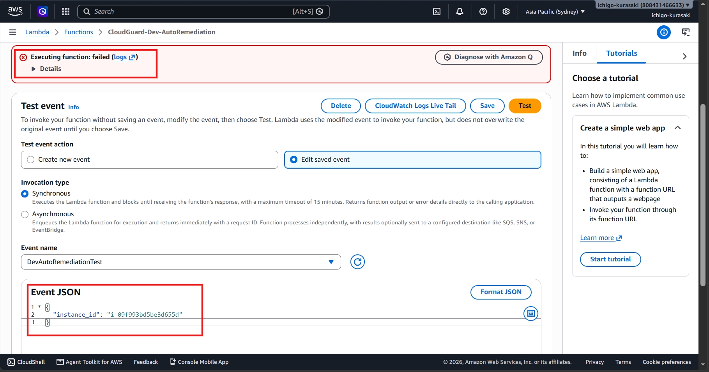
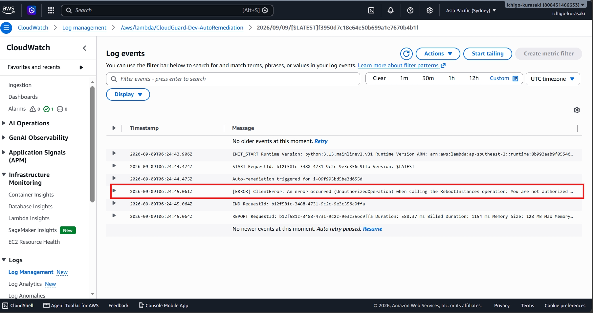
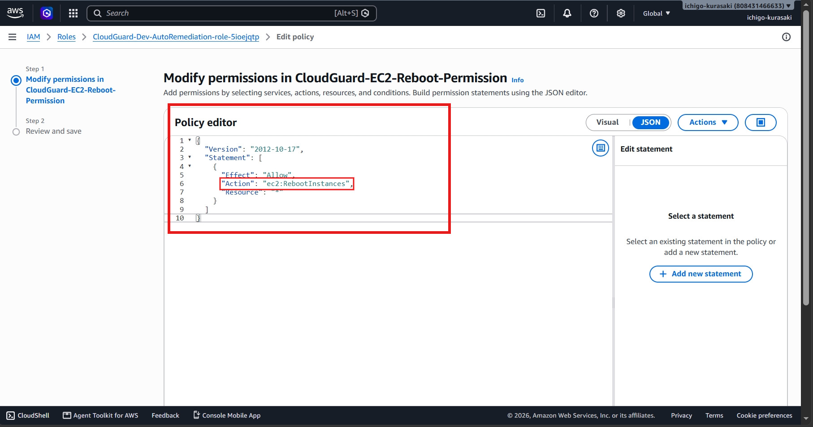
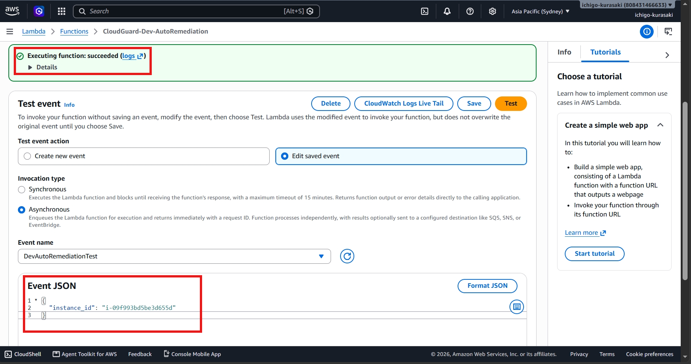
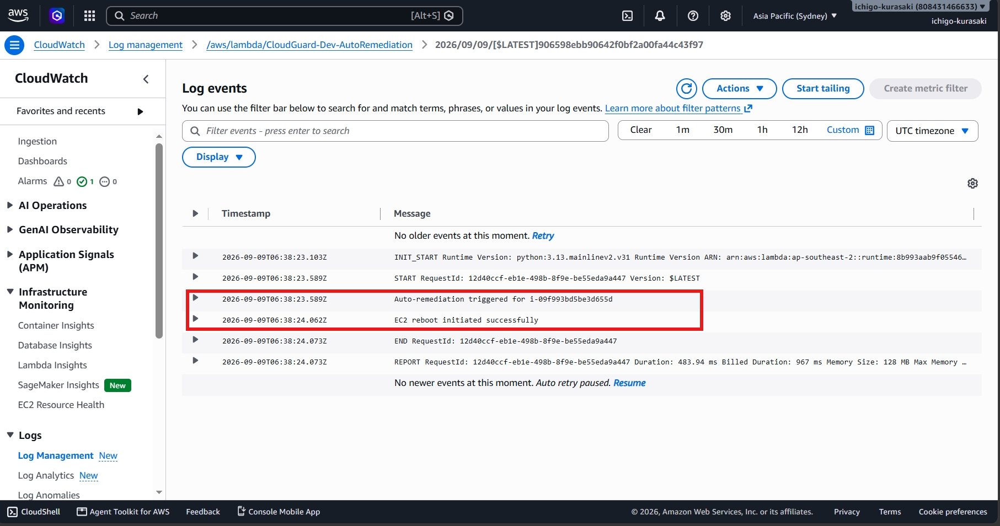

# Incident 02 – Lambda IAM Permission Denied

## Overview

During a controlled troubleshooting exercise, the Lambda function responsible for automatically rebooting an EC2 instance was intentionally configured with insufficient IAM permissions.

Although CloudWatch successfully invoked the Lambda function, the execution failed because the Lambda execution role was not authorized to perform the `ec2:RebootInstances` action.

The objective of this exercise was to identify the authorization failure, restore the required IAM permission, and validate successful auto-remediation.

---

## 1. Incident Introduced – IAM Permission Removed

The Lambda execution role policy was modified by removing the EC2 reboot permission.

This simulated a common production scenario where an incorrect IAM policy prevents automation from performing the intended action.

At this stage, the Lambda function could still be invoked but no longer had permission to reboot EC2 instances.

---

## 2. User Impact – Lambda Execution Failed

The Lambda function was executed using a test event.

Instead of completing successfully, the invocation failed because the execution role lacked the required EC2 permission.

### Observed Symptom

> Lambda execution failed while attempting to reboot the EC2 instance.

---

## 3. Investigation

CloudWatch Logs were reviewed to determine why the automation failed.

The logs confirmed that the Lambda function was denied permission to execute the `ec2:RebootInstances` API call.

### Root Cause

The Lambda execution role did not include the required IAM permission:

- `ec2:RebootInstances`

As a result, AWS denied the API request and the automated remediation could not complete.

---

## 4. Resolution

The missing IAM permission was restored to the Lambda execution role.

Once the policy was updated, the Lambda function was executed again.

The function completed successfully and initiated the EC2 reboot operation.

---

## 5. Final Validation

CloudWatch Logs were reviewed after the policy update.

The logs confirmed that the Lambda function completed successfully and initiated the EC2 reboot without any authorization errors.

The automation workflow was fully restored, confirming successful incident resolution.

---

## Troubleshooting Method

**Identify Failure -> Review Logs -> Find Root Cause -> Restore IAM Permission -> Validate Automation**

---

## Skills Demonstrated

- AWS IAM
- IAM Policy Troubleshooting
- AWS Lambda
- Amazon EC2
- Amazon CloudWatch Logs
- Least Privilege Principle
- Root Cause Analysis
- Cloud Automation Troubleshooting
- Incident Resolution

---

## Key Takeaway

This incident demonstrates the importance of correctly configured IAM permissions in AWS automation workflows.

Rather than modifying the application code, the issue was isolated to the Lambda execution role, the missing permission was restored, and the automated EC2 remediation process was successfully validated. It highlights a practical cloud support scenario where identifying and correcting IAM authorization issues restores service functionality with minimal changes.
