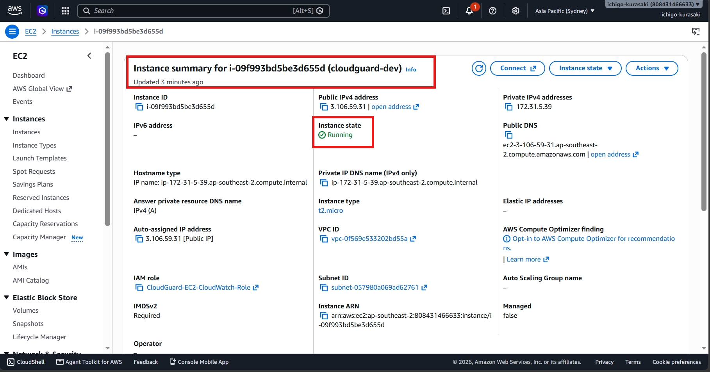
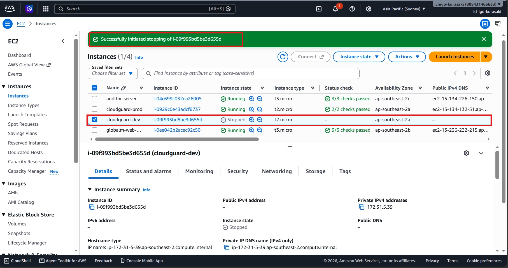
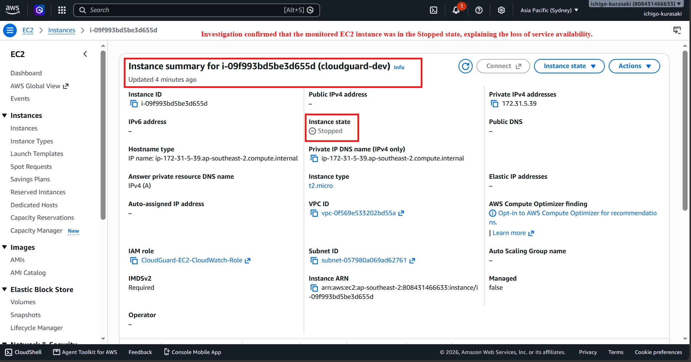
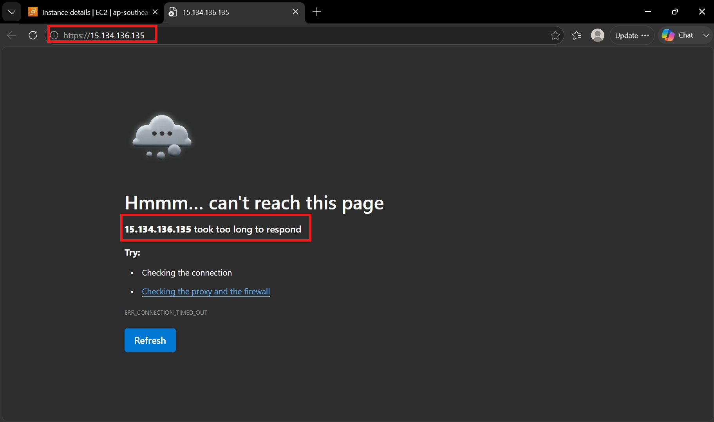
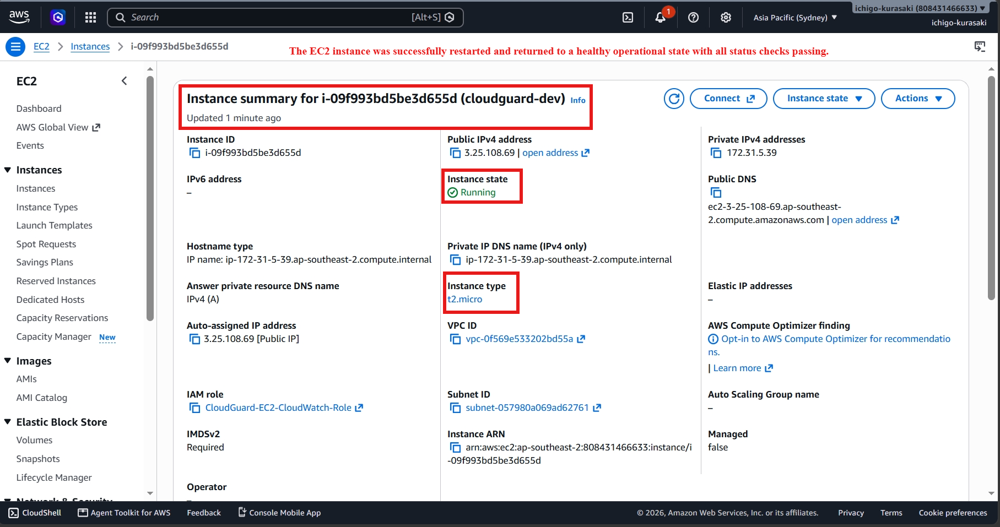
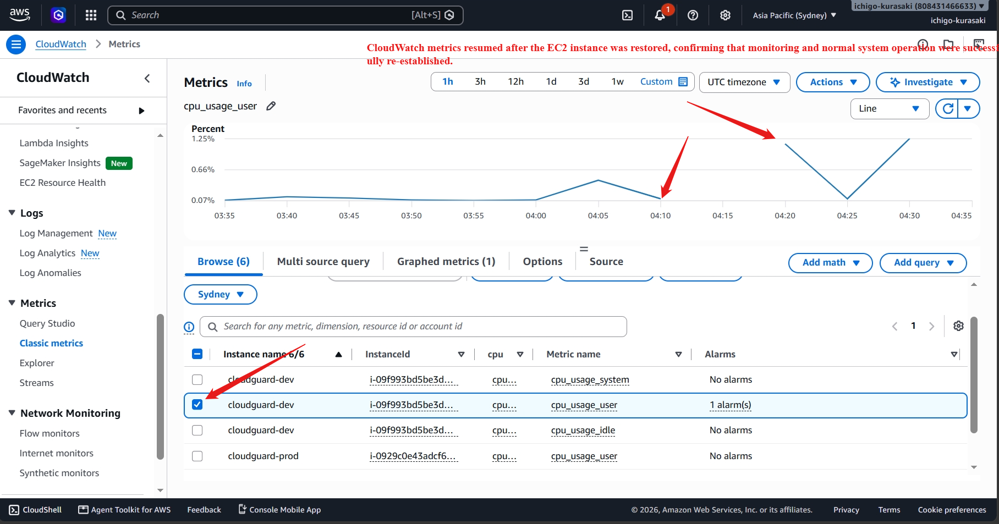

# Incident 05 – EC2 Instance Availability Recovery

## Overview

During a controlled troubleshooting exercise, the monitored EC2 instance was intentionally stopped to simulate an infrastructure availability incident.

As a result, the hosted application became unavailable and CloudWatch monitoring temporarily stopped receiving CPU metrics. The objective was to identify the service disruption, restore the EC2 instance, and validate that monitoring resumed successfully.

---

## 1. Healthy Baseline

Before introducing the incident, the monitored EC2 instance was running normally and passed all EC2 status checks.

---

## 2. Incident Introduced – EC2 Instance Stopped

The **cloudguard-dev** EC2 instance was intentionally stopped to simulate an infrastructure outage.

---

## 3. Investigation

The EC2 console was reviewed to determine the cause of the service interruption.

The investigation confirmed that the monitored EC2 instance was in the **Stopped** state, explaining why the hosted application and monitoring services were unavailable.

### Root Cause

The monitored EC2 instance had been stopped, making the application unavailable and preventing CloudWatch from collecting new performance metrics.

---

## 4. User Impact

While the EC2 instance remained unavailable, the hosted application could not be accessed.

**Observed Symptom**

> The hosted application was unreachable because the underlying EC2 instance was not running.

---

## 5. Resolution

The EC2 instance was started and allowed to complete all health checks.

After the instance returned to the **Running** state with **2/2 status checks passed**, normal operation was restored.

---

## 6. Final Validation

CloudWatch metrics were reviewed after the EC2 instance was restored.

The metric graph showed a temporary gap while the instance was unavailable, followed by the resumption of CPU metric collection, confirming that monitoring automatically recovered after the service was restored.

---

## Troubleshooting Workflow

**Identify Service Outage -> Verify EC2 State -> Restore Instance -> Validate Health Checks -> Confirm Monitoring Recovery**

---

## AWS Skills Demonstrated

- Amazon EC2
- EC2 Instance Management
- Amazon CloudWatch
- Infrastructure Monitoring
- Availability Troubleshooting
- Root Cause Analysis
- Incident Resolution

---

## Key Takeaway

This incident demonstrates how an EC2 instance availability issue directly impacts hosted applications and monitoring workflows. By identifying the stopped instance, restoring it to a healthy running state, and validating the return of CloudWatch metrics, normal service operation was successfully recovered.
