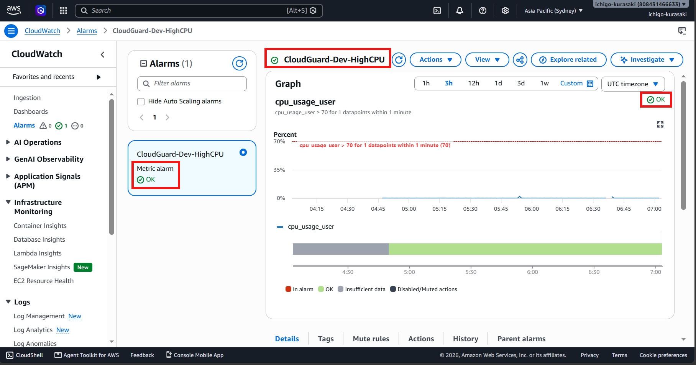
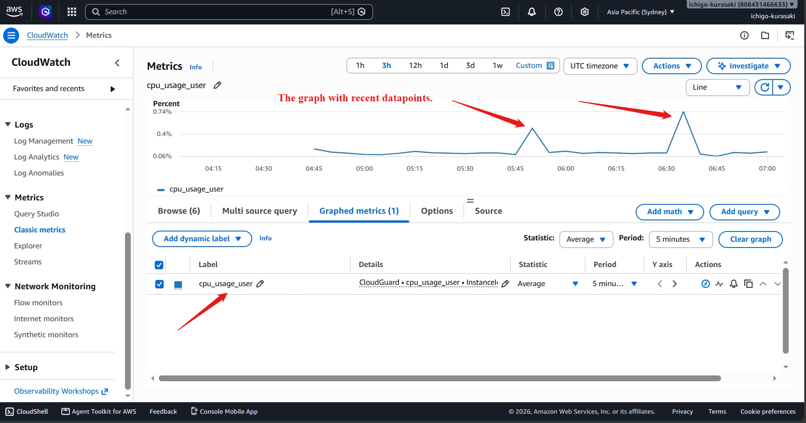
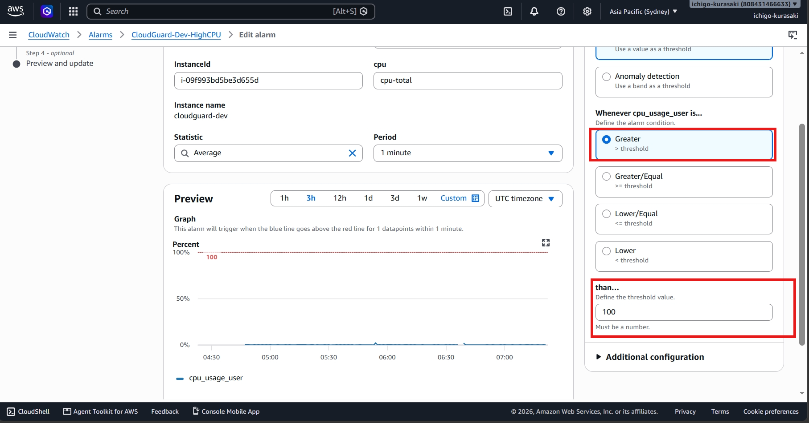
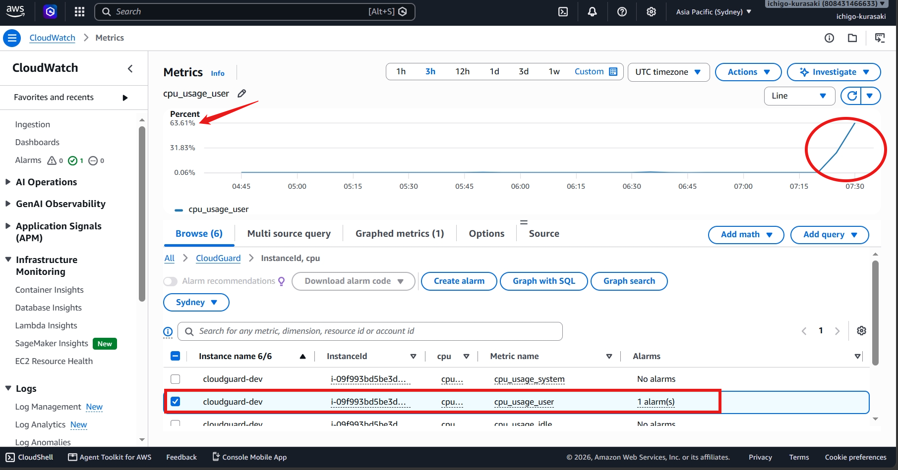
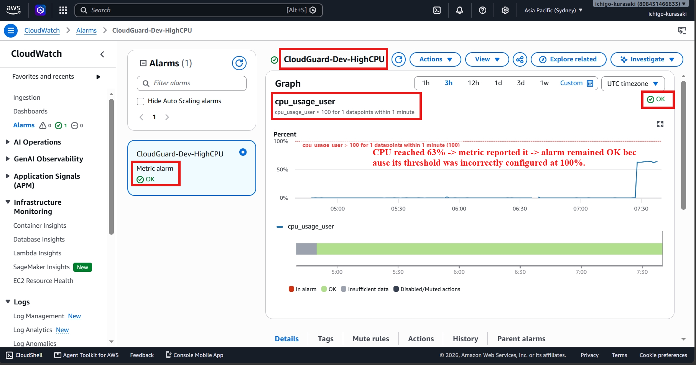
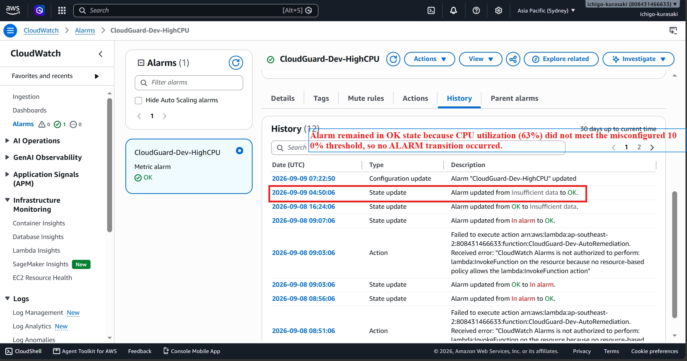
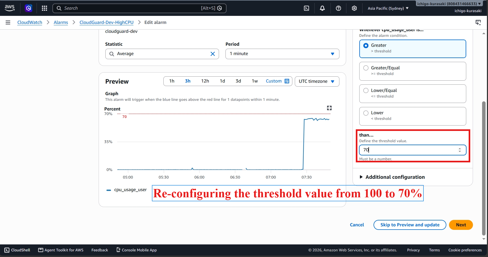
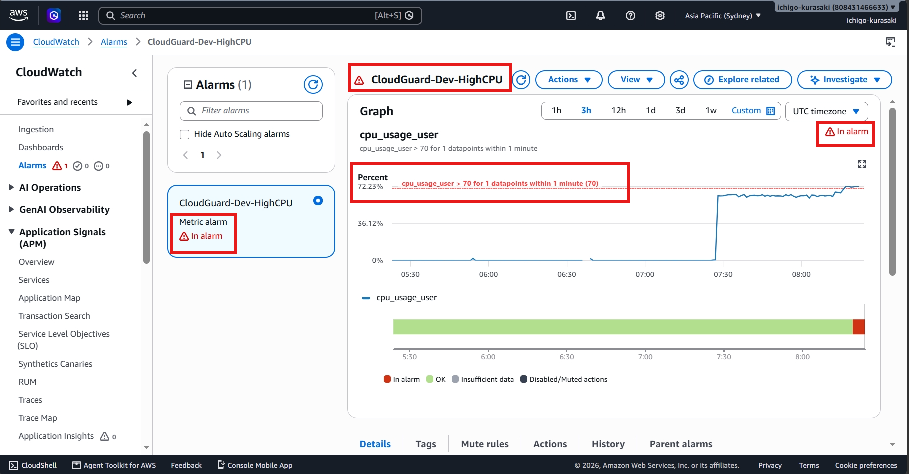

# Incident 04 – CloudWatch Alarm Not Triggering

## Overview

During a controlled troubleshooting exercise, the CloudWatch alarm was intentionally misconfigured by changing the CPU threshold from **70%** to **100%**.

Although the CloudWatch Agent continued publishing CPU metrics, the alarm never entered the **ALARM** state, preventing the Lambda auto-remediation workflow from being triggered.

The objective was to identify the monitoring issue, restore the correct alarm configuration, and validate successful alarm activation.

---

## 1. Incident Introduced – Alarm Misconfigured

The CloudWatch alarm threshold was changed from **70%** to **100%**, simulating a production configuration error.

---

## 2. User Impact

High CPU utilization was generated on the monitored EC2 instance.

Although CloudWatch continued receiving CPU metrics, the alarm remained in the **OK** state due to the incorrect threshold. As a result, the Lambda auto-remediation workflow was not triggered.

**Observed Symptom**

> High CPU utilization was detected, but the CloudWatch alarm did not transition to **ALARM**.

---

## 3. Investigation

CloudWatch metrics and alarm history were reviewed to isolate the issue.

The investigation confirmed:

- CloudWatch Agent was publishing CPU metrics successfully.
- CPU utilization increased as expected.
- Alarm threshold was incorrectly configured to **100%**.
- Alarm never entered the **ALARM** state.

### Root Cause

The CloudWatch alarm threshold was set too high, preventing the alarm condition from being met.

---

## 4. Resolution

The alarm threshold was restored from **100%** back to **70%**.

After re-testing with high CPU utilization, the alarm successfully transitioned to the **ALARM** state, restoring the monitoring workflow.

---

## Troubleshooting Workflow

**Identify Issue -> Verify Metrics -> Review Alarm Configuration -> Restore Threshold -> Validate Alarm**

---

## AWS Skills Demonstrated

- Amazon CloudWatch
- CloudWatch Alarms
- CloudWatch Agent
- Amazon EC2 Monitoring
- Performance Monitoring
- Root Cause Analysis
- Incident Resolution

---

## Key Takeaway

This incident highlights the importance of accurate CloudWatch alarm configuration in automated monitoring workflows. By identifying and correcting the misconfigured threshold, the alarm successfully resumed triggering automated remediation without requiring any infrastructure or application changes.
